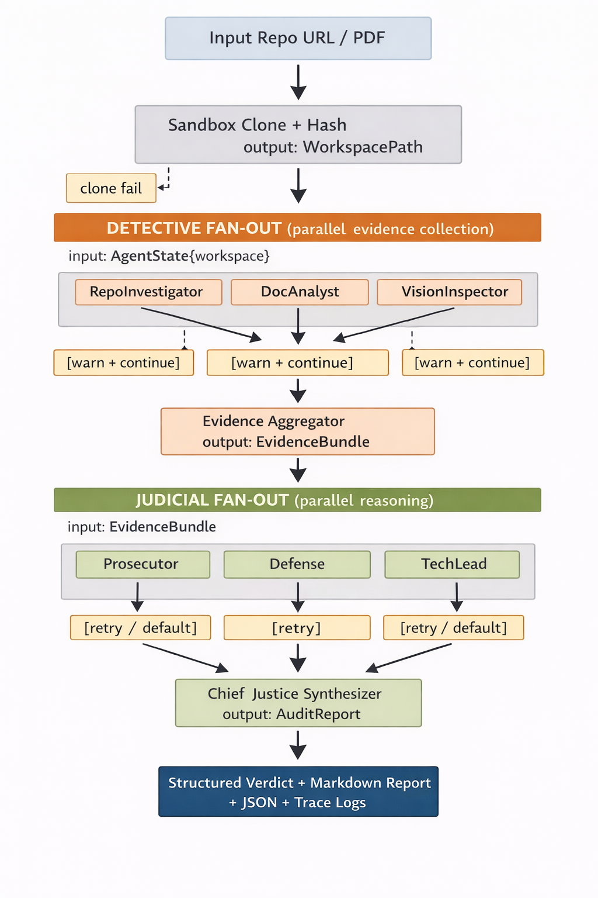

# Hierarchical Multi-Agent Repository Auditor

## Interim Technical Report

**By Amare Kassa**
**February 25, 2026**

---

## 1. Executive Summary

The Automaton Auditor is a production-grade, hierarchical multi-agent system that automatically audits software repositories and produces structured, evidence-backed technical assessments.

Rather than relying on a single large language model, the system decomposes auditing into specialized roles organized as a deterministic state graph:

- **Detectives** → collect factual evidence only
- **Judges** → independently reason over evidence
- **Chief Justice** → synthesize a final verdict

This separation enforces:

- factual correctness
- parallel execution
- deterministic state transitions
- reduced hallucination risk
- scalable architecture

The current implementation includes:

- typed shared state using Pydantic
- AST-based static analysis
- sandboxed repo execution
- parallel detective layer
- planned parallel judicial layer
- structured JSON/Markdown audit reports

---

## 2. Architectural Philosophy

### 2.1 Core Principle: Separate Observation from Reasoning

A single agent performing both evidence gathering and judgment introduces:

- confirmation bias
- hallucinated facts
- non-reproducible behavior
- poor parallelism

We enforce a strict boundary:

| Layer         | Responsibility         | Restrictions        |
| ------------- | ---------------------- | ------------------- |
| Detective     | Gather facts only      | No scoring/opinion  |
| Judicial      | Score + argue          | No filesystem/tools |
| Chief Justice | Aggregate + synthesize | No new facts        |

This mirrors courtroom-style adversarial reasoning and improves reliability.

---

## 3. System Overview (End-to-End Flow)

The full execution pipeline is shown below:

### Data Flow & Failure Semantics

- Each stage consumes and emits typed state objects.
- Detective failures degrade gracefully (warnings) while judicial failures trigger retries or default scores.
- Critical failures (clone or workspace corruption) abort execution early to avoid misleading reports.

This design ensures:

- deterministic execution
- partial robustness
- safe degradation
- audit integrity

Two synchronization barriers exist:

1. Evidence aggregation
2. Judicial synthesis

This guarantees:

- reasoning never begins on partial evidence
- verdicts use complete information
- execution remains deterministic

### Fig 1. End-to-End Flow

---

## 4. Key Architectural Decisions & Trade-offs

### 4.1 Typed State with Pydantic

**Decision**: Use strongly typed Pydantic models instead of raw dictionaries.
**Why**:

- validation guarantees
- schema enforcement
- safer multi-agent contracts
- easier serialization

**Trade-offs**:

| Benefit         | Cost               |
| --------------- | ------------------ |
| correctness     | slightly slower    |
| maintainability | more boilerplate   |
| tooling support | stricter refactors |

**Rationale**: Auditing is correctness-critical; safety outweighs micro-performance.

### 4.2 AST-Based Static Analysis

**Decision**: Use Python AST parsing instead of regex/grep.
**Why**:

- syntactically correct extraction
- structured imports/exports
- language-aware reasoning

**Trade-offs**:

| Benefit   | Cost              |
| --------- | ----------------- |
| accuracy  | Python-specific   |
| structure | higher complexity |

**Rationale**: False positives from regex would undermine audit credibility.

### 4.3 Sandboxed Tool Execution

**Decision**: All repo operations run in isolated temporary directories.
**Why**:

- prevents malicious repo execution
- avoids host contamination
- reproducible environments

**Trade-offs**:

| Benefit | Cost               |
| ------- | ------------------ |
| safety  | small I/O overhead |

**Rationale**: Security is non-negotiable when cloning arbitrary repos.

### 4.4 Parallel Fan-Out Architecture

**Decision**: Detectives and judges execute concurrently.
**Why**:

- reduces latency
- increases independence
- enables horizontal scaling

**Trade-offs**:

| Benefit | Cost                    |
| ------- | ----------------------- |
| speed   | coordination complexity |

**Rationale**: Audits are embarrassingly parallel tasks.

---

## 5. Detective Layer Design

Detectives only gather evidence and do not reason.

**Implemented agents**:

- **RepoInvestigator** → Git metadata + file structure
- **DocAnalyst** → PDF parsing
- **VisionInspector** → diagram/image extraction

**Properties**:

- pure functions
- deterministic
- parallel safe
- side-effect isolated

**Output**: `Dict[str, Evidence]`

Each item includes:

- source
- content
- timestamp
- metadata

---

## 6. Judicial Layer Design

Judges independently score evidence using rubric criteria.

**Planned agents**:

- **Prosecutor** → find risks
- **Defense** → find strengths
- **TechLead** → assess engineering quality

**Why independent judges?**

Prevents:

- single-model bias
- cascading hallucination
- overconfident conclusions

Produces:

- dialectical reasoning
- explainable results

**Output**: `JudicialOpinion[]`

Each opinion includes:

- criterion
- score
- argument
- cited evidence IDs

---

## 7. Synthesis Engine (Chief Justice)

The Chief Justice:

- aggregates scores
- averages per criterion
- composes summary
- generates report

Produces:

- JSON verdict
- Markdown audit report

This stage is deterministic and contains no new reasoning.

---

## 8. Known Gaps & Forward Plan

**Remaining Work**:

- **Judicial implementation**: prompt templates, rubric scoring, parallel execution
- **Aggregation**: score normalization, conflict handling, weighted scoring
- **Reporting**: structured markdown, evidence citations, remediation plans
- **Observability**: trace logging, timing metrics, failure tracking

---

## 9. Anticipated Failure Modes & Mitigations

| Failure               | Risk            | Mitigation           |
| --------------------- | --------------- | -------------------- |
| malicious repos       | code execution  | sandbox clone        |
| hallucinated evidence | false claims    | detective-only facts |
| judge bias            | skewed scoring  | multiple judges      |
| race conditions       | incomplete data | fan-in barrier       |
| large repos           | timeouts        | batching             |
| PDF parsing errors    | missing docs    | fallback logs        |

---

## 10. Scalability Strategy

The architecture scales horizontally:

- add more detectives for new modalities
- add more judges for deeper reasoning
- execution time ≈ slowest node only

No redesign required.

---

## 11. Conclusion

The Automaton Auditor implements a structured, reliable approach to repository auditing using:

- typed shared state
- deterministic graph orchestration
- parallel evidence gathering
- adversarial reasoning
- explainable verdict synthesis

By explicitly separating observation from judgment and enforcing synchronization barriers, the system prioritizes correctness, reproducibility, and scalability over convenience.

**Next Milestone**: complete the judicial layer and reporting engine to deliver fully automated, production-grade audits.
